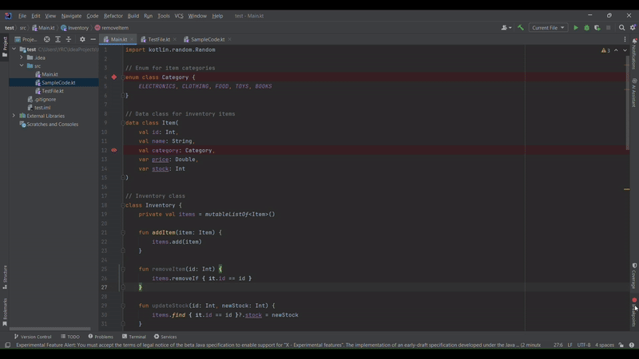

# BreakpointTracker

An Intellij plugin that displays the total number of breakpoints in the project and their locations in a custom tool window.

## Features

- Displays the total number of breakpoints in the project in real-time.
- Supports both line breakpoints and other specific breakpoints such as exceptions.
- Lists the locations of each breakpoint in a the tool window.
- Integrates seamlessly with the IntelliJ platform.
- Helps developers manage breakpoints efficiently during debugging sessions.

## Example

After setting breakpoints in your project, the tool window will display something like:

```
MainActivity.kt: Line 42
Utils.kt: Line 15
Service.kt: Line 27
```



## Usage

After installation:

- The plugin activates automatically when you open a project in IntelliJ.
- It scans the project for breakpoints and displays their count and locations.
- Use the tool window to review all breakpoints and navigate to their respective lines in the code.

### Managing Breakpoints

1. Open the BreakpointTracker tool window from the sidebar.
2. Add or remove breakpoints as usual; the tool window updates in real-time.

## Building from Source

### Prerequisites

- **IntelliJ IDEA** or compatible JetBrains IDE
- **Java Development Kit (JDK) 17 or newer**
- **Gradle 7.5 or newer**

### Build Steps

1. **Clone the repository**:
    ```bash
    git clone https://github.com/aircode610/BreakpointTracker.git
    ```
2. **Navigate to the project directory**:
    ```bash
    cd BreakpointTracker
    ```
3. **Build the plugin**:
    ```bash
    ./gradlew buildPlugin
    ```
4. The plugin archive will be generated in the `build/distributions` directory.

### Running the Plugin

- **Run via Gradle**:
    ```bash
    ./gradlew runIde
    ```
- **Or install manually in IntelliJ**:
    1. Open IntelliJ and go to **Settings/Preferences** → **Plugins**.
    2. Click the **gear icon** ⚙ and select **"Install Plugin from Disk..."**.
    3. Choose the generated `.zip` file from `build/distributions/`.
    4. Restart IntelliJ.
